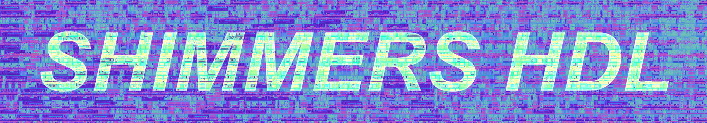

[](https://www.swift.org)



Shimmers (Synthesize Hardware In Modular Macro Expansions and Runtime in Swift) is a functional framework for creating circuits.
The principles behind Shimmers are to use functional code in Swift to describe hardware.
In other words, you specify what a circuit does, instead of what it looks like.
Shimmers allows you to describe the behavior of your circuit using regular Swift structs and functions.
Then, Shimmers macros turn them into hardware generators automatically.

For example, the following is a resettable counter:

```swift
@HardwareWire
struct Counter {
    var count: UInt8 = 0

    @TopLevel(name: "counter", isSequential: true)
    mutating func clock(reset: Bool) -> UInt8 {
        let lastCount = count
        count = reset ? 0 : count &+ amount
        return lastCount
    }
}
```

## Documentation

Documentations for Shimmers can be accessed on Swift Package Index.
Here is the links for the documentation of each of Shimmers components:

* [Shimmers](https://swiftpackageindex.com/yliu-hashed/shimmers-hdl/documentation)
* [ShimmersCLIWrapper](https://swiftpackageindex.com/yliu-hashed/shimmers-hdl/documentation/shimmerscliwrapper)

## Release

Since Shimmers uses Swift Macro through [swift-syntax](https://github.com/swiftlang/swift-syntax), you should use the Exact version Shimmers supports.

Currently, Shimmers only supports Swift 6.2.X.

To use Shimmers in a SwiftPM project, add `shimmers-hdl` as a dependency.
Specifically, add the following to your `Package.swift`.

```swift
dependencies: [
  .package(url: "https://github.com/yliu-hashed/shimmers-hdl.git", from: "<#latest-shimmers-version#>"),
],
```

## License

Please see [LICENSE](LICENSE) for more information.
